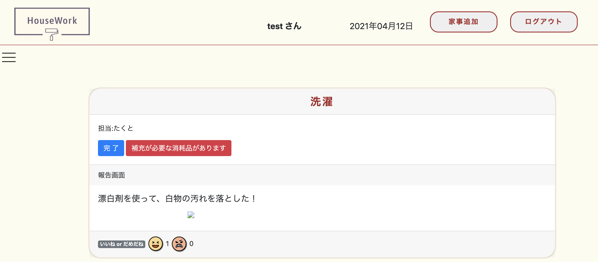
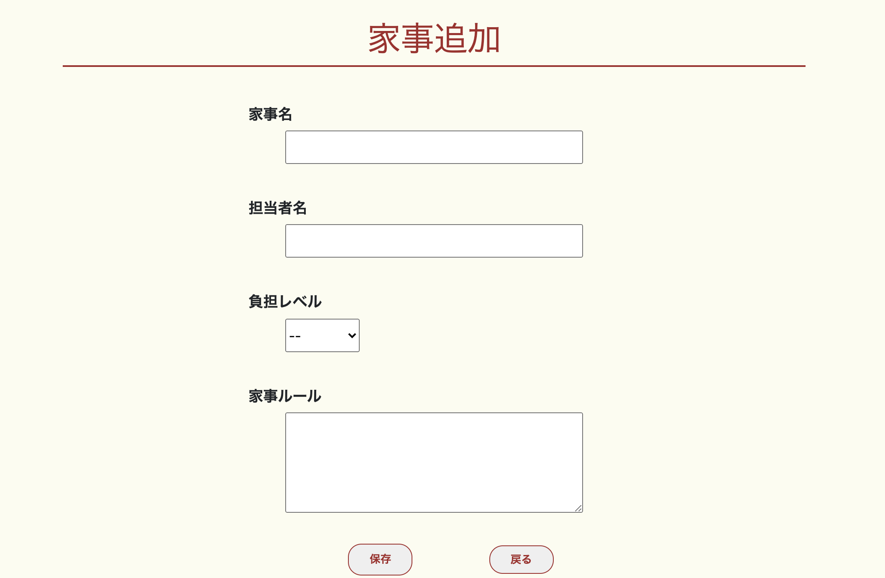
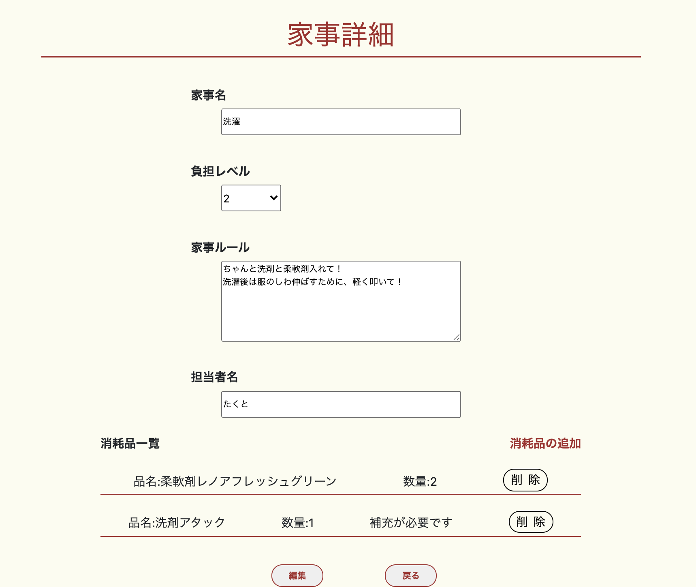
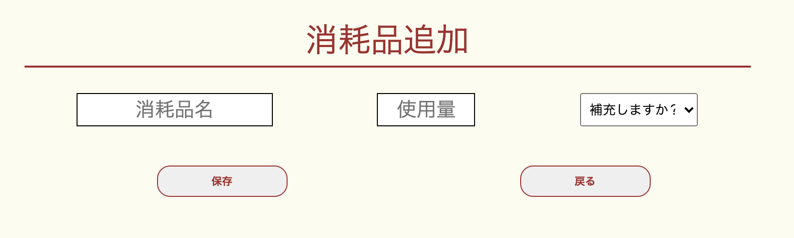
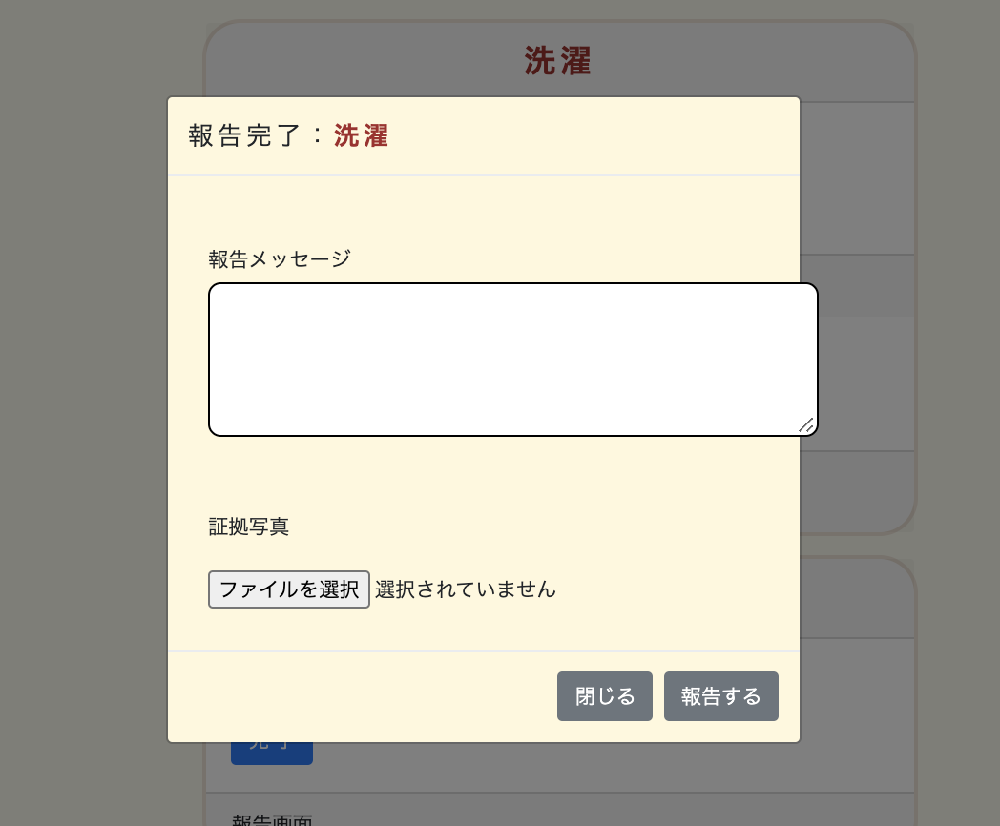

# 家事分担アプリ(87期チームa)
家事を分担し、管理することができます。

# 概要
## 家事の追加、分担
&nbsp; 必要な家事を追加し、登録されているユーザーに分担することができます。家事の負担レベルを登録できます。

### 本番環境
https://house-work87.herokuapp.com/
ログイン情報(テストアカウント)

+ testuser@test.com

+ test95

  

## 家事完了報告
&nbsp; 家事が完了したら画像つきで報告できます。また、他のユーザーがそれを「いいね」「ダメだね」で評価することができます。
## 消耗品管理
&nbsp; 家事に使用する洗剤などを追加し、残量を報告できます。追加が必要であるか不要であるかを選択できます。

# Demo
## トップページ

&nbsp; トップページに登録した家事の一覧が表示されています。家事詳細画面、追加ページにそれぞれ推移できます。家事の完了報告もこのページから実施します。
## 家事追加機能

&nbsp; 家事名、担当者、負担レベル、家事ルールを入力し保存します。

## 家事詳細ページ

&nbsp; 家事の詳細を確認できます。また消耗品追加ボタンより、消耗品を追加できます。
## 消耗品追加ページ

&nbsp; 消耗品名、容量、追加の必要を選択します。

## 家事報告機能
  
&nbsp; 家事を画像つきで報告できます。また、その報告に対して「いいね」「ダメだね」で評価できます。

# 工夫したポイント
## フロントの見やすさ
&nbsp; ヘッダーに追加ボタンやユーザー名を表示させ、本文は家事一覧のみを表示させました。スッキリとした表示になっており、家事を一目で把握しやすくなっています。
## 完了報告機能
&nbsp; 画像つきで完了報告ができます。掃除の質を上げるため、完了報告後に評価ボタンを取り付けました。
## 消耗品追加機能
&nbsp; 家事をしなかったユーザーも消耗品の残量を把握できる機能です。家事詳細ページから推移でき、複数の消耗品を登録できるようにしています。

# 開発環境
## フロント
&nbsp; html css javascript bootstrap
## バックエンド
&nbsp; ruby(2.6.5) Rails(6.0.3.5)
## インフラ    　

# テーブル設計　

## users テーブル

| Column   | Type   | Options     |
| -------- | ------ | ----------- |
| name     | string | null: false |
| email    | string | null: false |
| password | string | null: false |

### Association

- has_many :works
- has_many :reports
- has_one :nice
- has_one :bad

## works テーブル

| Column | Type       | Options                        |
| ------ | ---------- | ------------------------------ |
| name   | string     | null: false                    |
| rule   | text       | null: false                    |
| parson | string     | null: false                    |
| weight | integer    | null: false                    |
| user   | references | null: false, foreign_key: true |

### Association

- belongs_to :user
- has_many :items

## items テーブル

| Column      | Type       | Options                        |
| ----------- | ---------- | ------------------------------ |
| name        | string     | null: false                    |
| quantity    | string     | null: false                    |
| needs       | string     | null: false                    |
| work        | references | null: false, foreign_key: true |

### Association

- belongs_to :work

## reports テーブル

| Column      | Type       | Options                        |
| ----------- | ---------- | ------------------------------ |
| message     | string     | null: false                    |
| user        | references | null: false, foreign_key: true |
| work        | references | null: false, foreign_key: true |

### Association

- belongs_to :user
- belongs_to :work
- has_one :nice
- has_one :bad

## nice テーブル

| Column      | Type       | Options                        |
| ----------- | ---------- | ------------------------------ |
| user        | references | null: false, foreign_key: true |
| work        | references | null: false, foreign_key: true |

### Association

- belongs_to :user

- belongs_to :report

## bad テーブル

| Column      | Type       | Options                        |
| ----------- | ---------- | ------------------------------ |
| user        | references | null: false, foreign_key: true |
| work        | references | null: false, foreign_key: true |

### Association

- belongs_to :user
- belongs_to :report
